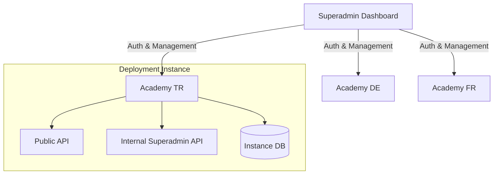

# Superadmin System Architecture

## Overview
The Superadmin system acts as a "Single Pane of Glass" for all Greenleaf Academy instances globally.

## Communication Protocol
- **Outbound:** Superadmin initiates requests to Deployments.
- **Payload:** JSON over HTTPS.
- **Security:** Bearer Token (X-Superadmin-Key).

## Core Modules
1. **Deployment Registry**: Database of all instances.
2. **Proxy Service**: Forwarding system-level requests.
3. **Metric Aggregator**: Combined view of all users and activity.
4. **Auth Service**: Superadmin-specific login (separate from academies).
